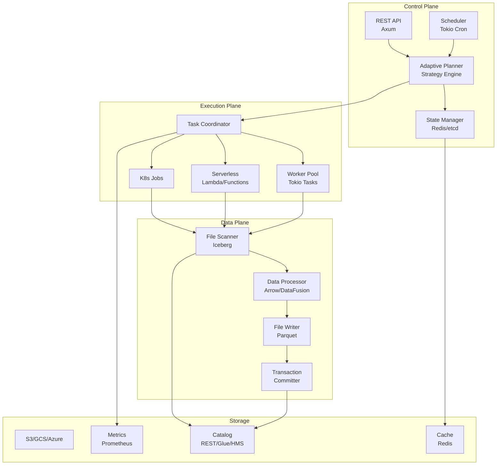

# Iceberg Compaction: Learning and Architecture Document

## Table of Contents
1. [Executive Summary](#executive-summary)
2. [Codebase Analysis](#codebase-analysis)
   - [Nimtable's iceberg-compaction](#nimtables-iceberg-compaction)
   - [Apache Amoro](#apache-amoro)
3. [Key Learnings](#key-learnings)
4. [Gap Analysis](#gap-analysis)
5. [Proposed Architecture](#proposed-architecture)
6. [Implementation Strategy](#implementation-strategy)
7. [Technical Decisions](#technical-decisions)
8. [Roadmap](#roadmap)

---

## Executive Summary

This document captures the analysis and learnings from studying two production Iceberg compaction implementations:
1. **Nimtable's Rust implementation** (`/Users/shreyas/iceberg-compaction/`) - A high-performance, single-node compaction engine
2. **Apache Amoro** (`/Users/shreyas/work/amoro/`) - A distributed, production-ready lakehouse management system

The goal is to design a new compaction service that combines the best of both worlds: Rust's performance with enterprise-grade distributed capabilities, while introducing novel cloud-native features neither system currently provides.

---

## Codebase Analysis

### Nimtable's iceberg-compaction

**Location**: `/Users/shreyas/iceberg-compaction/`

#### Architecture Overview
```
┌──────────────────────────────────────────┐
│          Core Library                     │
├──────────────────────────────────────────┤
│  • CompactionPlanner                     │
│  • CompactionExecutor                    │
│  • FileSelector                          │
│  • DataFusion Integration                │
└──────────────────────────────────────────┘
                    │
                    ▼
┌──────────────────────────────────────────┐
│         Execution Engine                 │
├──────────────────────────────────────────┤
│  • DataFusionExecutor                    │
│  • RollingIcebergWriter                  │
│  • FileScanTaskTableProvider             │
└──────────────────────────────────────────┘
```

#### Key Components

1. **Configuration Management** (`core/src/config/`)
   - `CompactionPlanningConfig`: Controls file selection and grouping
     - Small file threshold: 32MB (default)
     - Max task size: 50GB
     - Target file size: 1GB
   - `CompactionExecutionConfig`: Controls execution behavior
     - Parallelism based on CPU cores
     - Parquet writer configuration (Snappy compression)
     - Dynamic size estimation support

2. **Compaction Core** (`core/src/compaction/mod.rs`)
   - **2260+ lines of well-tested code**
   - `CompactionBuilder`: Fluent API for building compaction instances
   - `CompactionPlanner`: Generates plans based on file statistics
   - `CommitManager`: Handles atomic commits with retry logic
   - Supports both Full and MergeSmallDataFiles compaction types

3. **File Selection Strategy** (`core/src/file_selection/`)
   - `FileGroup`: Represents files to be compacted together
   - `CompactionStrategy`: Trait for different selection strategies
   - `FileStrategyFactory`: Creates strategies based on compaction type
   - Intelligent parallelism calculation based on file sizes

4. **Execution Layer** (`core/src/executor/`)
   - `CompactionExecutor` trait: Abstraction for execution engines
   - `DataFusionExecutor`: High-performance Apache Arrow-based execution
   - `RollingIcebergWriter`: Manages file rolling based on size thresholds
   - Integration with Iceberg's FileScanTask for reading

#### Strengths
- ✅ **Performance**: Rust + DataFusion = extremely fast execution
- ✅ **Memory Efficient**: Streaming processing with Arrow
- ✅ **Clean Abstractions**: Well-designed traits and interfaces
- ✅ **Comprehensive Testing**: 650+ lines of test code
- ✅ **Multi-Cloud Support**: S3, GCS, Azure via iceberg-rs

#### Limitations
- ❌ **Single Node Only**: No distributed execution
- ❌ **No REST API**: Library-only, no service interface
- ❌ **Limited Monitoring**: Basic metrics only
- ❌ **No Scheduling**: Requires external orchestration
- ❌ **No State Management**: Can't resume failed compactions

---

### Apache Amoro

**Location**: `/Users/shreyas/work/amoro/`

#### Architecture Overview
```
┌─────────────────────────────────────────────┐
│         Amoro Management Server (AMS)        │
├─────────────────────────────────────────────┤
│  • Optimization Planning                     │
│  • Task Distribution                         │
│  • Monitoring & Metrics                      │
│  • Web UI                                   │
└─────────────────────────────────────────────┘
                      │
        ┌─────────────┼─────────────┐
        ▼             ▼             ▼
┌──────────┐  ┌──────────┐  ┌──────────┐
│  Spark   │  │  Flink   │  │  Local   │
│ Executor │  │ Executor │  │ Executor │
└──────────┘  └──────────┘  └──────────┘
```

#### Key Components

1. **Table Format Support** (`amoro-format-*/`)
   - `IcebergTable`: Native Iceberg table wrapper
   - `MixedTable`: Iceberg + Changelog hybrid
   - `KeyedTable` vs `UnkeyedTable` abstraction
   - Support for Hudi, Paimon formats

2. **Optimization System** (`amoro-optimizer/`)
   ```java
   // Sophisticated planning
   AbstractOptimizingPlanner
   ├── IcebergOptimizingPlanner
   ├── MixedIcebergOptimizingPlanner
   └── PartitionEvaluator
   ```

   **Planning Algorithm**:
   - Evaluates partition fragmentation
   - Calculates duplicate ratio
   - Determines optimization type (Minor/Major/Full)
   - Creates RewriteStageTask list

3. **Table Properties Configuration**
   ```properties
   # Optimization Configuration
   self.optimizing.enabled = true
   self.optimizing.target-size = 134217728 (128MB)
   self.optimizing.max-file-count = 10000
   self.optimizing.fragment-ratio = 8

   # Triggers
   self.optimizing.minor.trigger.file-count = 12
   self.optimizing.minor.trigger.interval = 3600000ms
   self.optimizing.major.trigger.duplicate-ratio = 0.1
   self.optimizing.full.trigger.interval = -1 (disabled)

   # Expiration
   table.expire.enabled = true
   snapshot.keep.duration = 720min
   change.data.ttl = 10080min
   ```

4. **Execution Containers**
   - `FlinkOptimizerContainer`: Flink-based distributed execution
   - `SparkOptimizerContainer`: Spark-based distributed execution
   - `LocalOptimizerContainer`: Single-node execution
   - `KubernetesOptimizerContainer`: K8s native deployment

5. **Table Maintenance** (`IcebergTableMaintainer`)
   - `cleanOrphanFiles()`: Remove orphaned data files
   - `cleanDanglingDeleteFiles()`: Clean unused delete files
   - `expireSnapshots()`: Remove old snapshots
   - `expireData()`: TTL-based data purging
   - `autoCreateTags()`: Automatic snapshot tagging

#### Strengths
- ✅ **Production Ready**: Battle-tested in production environments
- ✅ **Distributed**: Scales horizontally with Spark/Flink
- ✅ **Comprehensive Monitoring**: Full metrics and Web UI
- ✅ **Sophisticated Planning**: Intelligent optimization decisions
- ✅ **Multi-Format Support**: Iceberg, Hudi, Paimon

#### Limitations
- ❌ **Heavy Deployment**: Requires full AMS server
- ❌ **Java Performance**: Slower than native Rust
- ❌ **Complex Setup**: Many moving parts
- ❌ **Not Cloud-Native**: Traditional deployment model

---

## Key Learnings

### 1. Compaction Strategy Insights

#### From Nimtable:
- **DataFusion Integration**: Using DataFusion provides excellent performance for data processing
- **Builder Pattern**: Fluent API makes configuration intuitive
- **Trait-Based Design**: Clean abstractions enable easy extension
- **File Grouping**: Smart bin-packing reduces number of output files

#### From Amoro:
- **Fragment Ratio Calculation**:
  ```java
  fragmentRatio = (equalityDeleteFileCount + positionDeleteFileCount) / dataFileCount
  ```
  Used to determine when major compaction is needed

- **Optimization Types**:
  - **Minor**: Small file consolidation (triggered by file count)
  - **Major**: Handle delete files (triggered by duplicate ratio)
  - **Full**: Complete rewrite (scheduled or manual)

- **Partition Evaluation**: Score partitions based on:
  - File count
  - Total size
  - Fragment ratio
  - Last optimization time

### 2. Performance Considerations

#### Memory Management:
- **Nimtable**: Uses streaming with configurable batch sizes (1024 rows default)
- **Amoro**: Configurable memory quotas and spill-to-disk support

#### Parallelism:
- **Nimtable**: `min(cpu_cores * 2, max_parallelism)`
- **Amoro**: Dynamic based on executor resources

#### File Sizes:
- **Nimtable**: Target 1GB files
- **Amoro**: Target 128MB files (more granular)

### 3. Production Requirements

**Essential Features for Production**:
1. **Checkpointing**: Resume failed compactions
2. **Monitoring**: Real-time progress and metrics
3. **Resource Limits**: Prevent resource exhaustion
4. **Multi-Tenancy**: Support multiple tables/users
5. **Cost Tracking**: Cloud API and compute costs

### 4. Architectural Patterns

#### State Management:
- Amoro uses persistent state in AMS database
- Nimtable is stateless (simpler but less resilient)

#### Task Distribution:
- Amoro: Pull-based (optimizers poll for tasks)
- Alternative: Push-based with work stealing

#### Commit Strategy:
- Both use atomic commits with retry
- Amoro adds transaction tracking in AMS

---

## Gap Analysis

### Market Gaps Identified

| Feature | Nimtable | Amoro | Gap |
|---------|----------|-------|-----|
| Rust Performance | ✅ | ❌ | Amoro lacks native performance |
| Distributed Execution | ❌ | ✅ | Nimtable is single-node only |
| Cloud-Native | ❌ | ❌ | Neither is truly cloud-native |
| Serverless Support | ❌ | ❌ | No Lambda/Functions support |
| Cost Optimization | ❌ | Partial | No cost-aware scheduling |
| ML-Based Planning | ❌ | ❌ | No predictive optimization |
| Multi-Cloud Native | Partial | Partial | Limited cloud integration |
| GitOps Friendly | ❌ | ❌ | No declarative configuration |
| SaaS Ready | ❌ | ❌ | No multi-tenancy, billing |

### Opportunities for Innovation

1. **Hybrid Execution Model**: Library + Service + Serverless
2. **Cost-Aware Compaction**: Minimize cloud costs, not just performance
3. **Predictive Scheduling**: ML-based optimal timing
4. **Cloud-Native First**: Kubernetes operator, Helm charts
5. **Developer Experience**: CLI, API, SDK, Terraform provider

---

## Proposed Architecture

### High-Level Design



### Core Components Design

#### 1. Adaptive Planner
```rust
pub struct AdaptivePlanner {
    strategies: HashMap<CompactionType, Box<dyn Strategy>>,
    evaluator: PartitionEvaluator,
    predictor: Option<CompactionPredictor>,
    cost_model: CostModel,
}

pub trait Strategy {
    fn score(&self, partition: &Partition) -> f64;
    fn plan(&self, partition: &Partition) -> CompactionPlan;
}

// Strategies to implement
pub enum CompactionType {
    SmallFiles,      // Merge small files
    DeleteFiles,     // Convert equality to position deletes
    TimeSeries,      // Optimize for time-based queries
    Dimensional,     // Optimize for analytical queries
    CostOptimized,   // Minimize cloud costs
    Adaptive,        // ML-based selection
}
```

#### 2. Execution Abstraction
```rust
pub trait ExecutionBackend {
    async fn execute(&self, plan: CompactionPlan) -> Result<CompactionResult>;
}

pub struct LocalBackend { /* Tokio-based local execution */ }
pub struct DistributedBackend { /* Ray/Ballista distributed */ }
pub struct ServerlessBackend { /* Lambda/Cloud Functions */ }
pub struct K8sBackend { /* Kubernetes Job based */ }

pub struct HybridExecutor {
    backends: Vec<Box<dyn ExecutionBackend>>,
    selector: BackendSelector, // Choose based on plan size
}
```

#### 3. State Management
```rust
pub struct StateManager {
    store: Box<dyn StateStore>, // Redis, etcd, or in-memory
    checkpoints: CheckpointManager,
    history: CompactionHistory,
}

pub struct Checkpoint {
    plan_id: Uuid,
    progress: Progress,
    completed_tasks: Vec<TaskId>,
    pending_tasks: Vec<TaskId>,
    metadata: HashMap<String, String>,
}
```

#### 4. Observability
```rust
pub struct Telemetry {
    metrics: MetricsRegistry,
    tracer: Tracer,
    logger: Logger,
}

// Key metrics to track
pub struct CompactionMetrics {
    // Performance
    pub files_processed: Counter,
    pub bytes_compacted: Counter,
    pub compression_ratio: Gauge,

    // Cost
    pub api_calls: Counter,
    pub compute_seconds: Counter,
    pub estimated_cost: Gauge,

    // Health
    pub queue_depth: Gauge,
    pub failure_rate: Gauge,
    pub p99_latency: Histogram,
}
```

### Deployment Modes

#### 1. Library Mode
```rust
use iceberg_compaction::{Compactor, Strategy};

let compactor = Compactor::builder()
    .catalog(catalog)
    .strategy(Strategy::CostOptimized)
    .target_file_size(ByteSize::gb(1))
    .build()?;

let result = compactor.compact_table("sales").await?;
```

#### 2. Service Mode
```yaml
# docker-compose.yml
services:
  compaction:
    image: iceberg-compaction:latest
    environment:
      CATALOG_TYPE: rest
      CATALOG_URI: http://catalog:8181
      REDIS_URL: redis://redis:6379
    ports:
      - "8080:8080"
```

#### 3. Kubernetes Operator
```yaml
apiVersion: compaction.io/v1
kind: CompactionPolicy
metadata:
  name: hourly-compaction
spec:
  catalog:
    type: glue
    database: production
  schedule: "0 * * * *"
  tables:
    - name: events
      strategy: time-series
      targetFileSize: 512Mi
    - name: dimensions
      strategy: small-files
      targetFileSize: 1Gi
  resources:
    memory: 4Gi
    cpu: 2
  costLimit:
    hourly: 10.00
```

#### 4. Serverless Mode
```rust
// Lambda handler
pub async fn handler(event: CompactionRequest) -> Result<CompactionResponse> {
    let compactor = ServerlessCompactor::from_env()?;

    // Break into Lambda-sized chunks
    let chunks = compactor.split_plan(event.plan)?;

    // Process chunk
    let result = compactor.process_chunk(chunks[event.chunk_id]).await?;

    // Save checkpoint
    compactor.checkpoint(event.plan_id, result).await?;

    Ok(CompactionResponse {
        chunk_id: event.chunk_id,
        status: "completed",
        next_chunk: event.chunk_id + 1,
    })
}
```

---

## Implementation Strategy

### Phase 1: Foundation (Week 1-2)

#### Goals
- Set up project structure
- Implement core compaction engine
- Basic catalog integration

#### Tasks
1. **Project Setup**
   ```bash
   cargo new iceberg-compaction --lib
   cargo new iceberg-compaction-cli --bin
   cargo new iceberg-compaction-server --bin
   ```

2. **Core Library Structure**
   ```
   src/
   ├── lib.rs
   ├── planner/
   │   ├── mod.rs
   │   ├── strategy.rs
   │   └── evaluator.rs
   ├── executor/
   │   ├── mod.rs
   │   ├── local.rs
   │   └── datafusion.rs
   ├── catalog/
   │   ├── mod.rs
   │   └── iceberg.rs
   └── config/
       └── mod.rs
   ```

3. **Basic Implementation**
   - Port Nimtable's DataFusion executor
   - Implement simple bin-packing strategy
   - Add REST catalog support

### Phase 2: Intelligence (Week 3-4)

#### Goals
- Port Amoro's planning algorithms
- Add cost modeling
- Implement adaptive strategies

#### Key Algorithms to Port

1. **Fragment Ratio Evaluation**
   ```rust
   fn calculate_fragment_ratio(partition: &Partition) -> f64 {
       let delete_files = partition.position_deletes + partition.equality_deletes;
       let data_files = partition.data_files;
       delete_files as f64 / data_files.max(1) as f64
   }
   ```

2. **Optimization Type Selection**
   ```rust
   fn determine_optimization_type(eval: &PartitionEvaluation) -> OptimizationType {
       if eval.fragment_ratio > 0.1 {
           OptimizationType::Major
       } else if eval.small_file_count > 12 {
           OptimizationType::Minor
       } else if eval.should_full_optimize() {
           OptimizationType::Full
       } else {
           OptimizationType::None
       }
   }
   ```

3. **Cost Model**
   ```rust
   struct CostModel {
       api_cost_per_1000: f64,      // S3 API pricing
       compute_cost_per_second: f64, // EC2/Lambda pricing
       storage_cost_per_gb: f64,     // Storage pricing
   }

   impl CostModel {
       fn estimate_compaction_cost(&self, plan: &CompactionPlan) -> f64 {
           let api_calls = plan.input_files * 2 + plan.output_files;
           let compute_time = plan.total_bytes / THROUGHPUT_BYTES_PER_SEC;

           (api_calls / 1000.0) * self.api_cost_per_1000 +
           compute_time * self.compute_cost_per_second
       }
   }
   ```

### Phase 3: Distribution (Week 5-6)

#### Goals
- Implement distributed execution
- Add state management
- Build checkpoint system

#### Components

1. **Task Distribution**
   ```rust
   pub struct TaskDistributor {
       workers: Vec<WorkerId>,
       queue: TaskQueue,
       scheduler: WorkStealingScheduler,
   }
   ```

2. **Checkpoint Management**
   ```rust
   pub struct CheckpointManager {
       store: Box<dyn StateStore>,
       retention: Duration,
   }

   impl CheckpointManager {
       async fn save_progress(&self, plan_id: Uuid, progress: Progress) -> Result<()>;
       async fn restore(&self, plan_id: Uuid) -> Result<Option<Checkpoint>>;
   }
   ```

### Phase 4: Cloud Native (Week 7-8)

#### Goals
- Kubernetes operator
- Serverless support
- Multi-cloud optimization

#### Deliverables

1. **Kubernetes CRDs**
   ```yaml
   apiVersion: apiextensions.k8s.io/v1
   kind: CustomResourceDefinition
   metadata:
     name: compactionpolicies.compaction.io
   ```

2. **Helm Chart**
   ```yaml
   # values.yaml
   replicaCount: 3
   image:
     repository: iceberg-compaction
     tag: latest
   resources:
     limits:
       memory: 4Gi
       cpu: 2
   ```

3. **Serverless Deployment**
   ```typescript
   // CDK stack for AWS Lambda
   const compactionFunction = new lambda.Function(this, 'CompactionFunction', {
     runtime: lambda.Runtime.PROVIDED_AL2,
     handler: 'bootstrap',
     code: lambda.Code.fromAsset('target/lambda'),
     memorySize: 3008,
     timeout: cdk.Duration.minutes(15),
   });
   ```

### Phase 5: Production (Week 9-10)

#### Goals
- Monitoring and alerting
- Documentation
- Performance optimization

#### Deliverables

1. **Monitoring Stack**
   - Prometheus metrics
   - Grafana dashboards
   - Alert rules

2. **Documentation**
   - API reference
   - Deployment guide
   - Performance tuning guide

3. **Testing**
   - Unit tests
   - Integration tests
   - Load tests
   - Chaos tests

---

## Technical Decisions

### Language Choice: Rust

**Pros**:
- Performance: 10-100x faster than Java for I/O operations
- Memory safety: No GC pauses
- Async/await: Perfect for I/O-bound operations
- Small binary size: Good for serverless
- Growing ecosystem: Arrow, DataFusion, object_store

**Cons**:
- Smaller talent pool
- Longer development time
- Less mature ecosystem

**Decision**: Use Rust for core engine, provide bindings for other languages

### Execution Engine: DataFusion vs Native

**DataFusion Pros**:
- Battle-tested Apache Arrow implementation
- SQL support for complex transformations
- Optimized columnar processing
- Active development

**Native Pros**:
- More control over memory
- Simpler dependencies
- Potentially faster for simple operations

**Decision**: Use DataFusion by default, allow pluggable executors

### State Store: Redis vs etcd vs PostgreSQL

**Redis**:
- Fast
- Good for caching
- Limited durability

**etcd**:
- Strong consistency
- Kubernetes native
- Limited query capability

**PostgreSQL**:
- Full SQL support
- ACID compliance
- More operational overhead

**Decision**: Support multiple backends, default to Redis for simplicity

### Deployment: Kubernetes vs Serverless vs Traditional

**Decision**: Support all three with shared core library:
- Kubernetes for enterprise
- Serverless for cost optimization
- Traditional for simple deployments

---

## Roadmap

### MVP (Month 1)
- [ ] Core compaction engine
- [ ] REST API
- [ ] Basic monitoring
- [ ] Docker image

### Beta (Month 2)
- [ ] Distributed execution
- [ ] Kubernetes operator
- [ ] Advanced strategies
- [ ] Web UI

### GA (Month 3)
- [ ] Serverless support
- [ ] Multi-cloud optimization
- [ ] Production monitoring
- [ ] Enterprise features

### Future (Month 4+)
- [ ] ML-based planning
- [ ] Auto-tuning
- [ ] SaaS offering
- [ ] Additional table formats

---

## Success Metrics

### Performance
- Compact 1TB in < 10 minutes
- Support tables with 1M+ files
- < 100ms planning latency

### Cost
- 50% reduction vs naive approaches
- < $0.10 per TB compacted
- Predictable cost model

### Reliability
- 99.9% success rate
- Zero data loss
- Automatic recovery from failures

### Adoption
- 100+ GitHub stars in 6 months
- 10+ production deployments
- 3+ cloud marketplace listings

---

## Conclusion

By combining the performance of Nimtable's Rust implementation with the sophistication of Amoro's planning algorithms, and adding cloud-native features that neither provides, we can create a unique and valuable solution in the Iceberg ecosystem.

The key differentiators will be:
1. **Hybrid execution model** (local/distributed/serverless)
2. **Cost-aware optimization**
3. **Cloud-native first design**
4. **Developer-friendly experience**
5. **Production-ready from day one**

This positions the project to fill a real gap in the market for a lightweight, efficient, and intelligent compaction service for modern data lakehouses.
